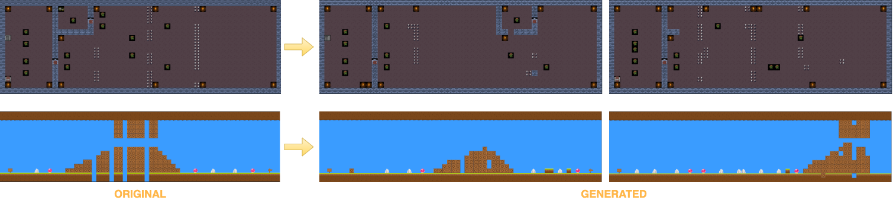
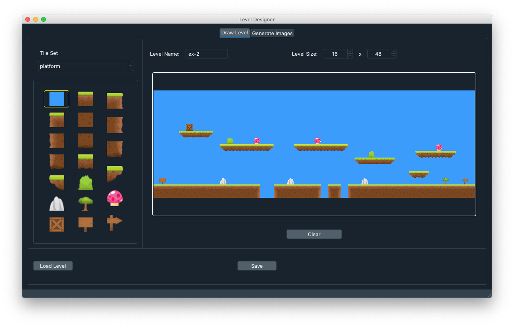
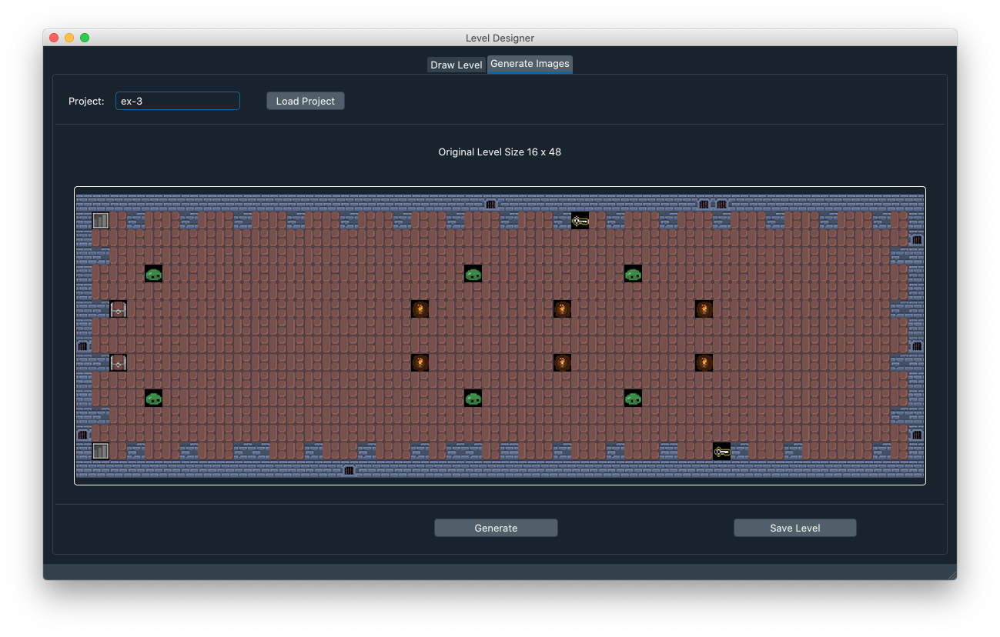

# PCG-ML with TOAD-GAN and Tensorflow 
## A 2D level generation system using a Tensorflow implementation of TOAD-GAN

This project provides a system for the design and the automatic generation of 2D tile-based video games levels using PCG-ML.  
To automatically generate levels it uses a Tensorflow implementation of TOAD-GAN, that requires only one training example.
The original repository can be found [here](https://github.com/Mawiszus/TOAD-GAN).  

The system is composed of:
- a training environment for TOAD-GAN
- a GUI application that allows to use trained TOAD-GAN to generate and save new levels and to manually design levels
to be used in the training process

The system is devised to be as game independent as possible. Levels are designed and generated using specific tile sets.
Two default sets are provided, but users can define and use their own putting them inside the `resources/tokensets` folder.

## Requirements
| Package | Version |
| ------- | ------- |
| **pillow** | tested on v8.0.1 |
| **python** | tested on v3.7.9 | 
| **pyqt** | tested on v5.12.3 |
| **qdarkstyle** | tested on v2.8.1 |
| **tensorflow** | tested on v2.0.0 |

## TOAD-GAN and Training Environment
To train a TOAD-GAN it is sufficient to specify the example level and the tile set it uses inside the [config.yaml](config.yaml) file.
The application will search for the training level inside the `resources/levels` folder. 

For example
specifying inside the `config.yaml` file:
```
LEVEL:
  TYPE: "default"
  NAME: "ex-1"
```
The application will search for the level file `ex-1.json` inside the `resources/levels/default` folder.

The `config.yaml` file allows to specify other TOAD-GAN and training settings. A complete list can be found inside the
`config.py` file. For further information please refer to the [report](report.pdf).

Once set up the configuration, running `python main.py` will train a TOAD-GAN on the chosen game level with the specified
settings.
At the end of the training process a TOAD-GAN project will be saved inside the `output` folder.

A __TOAD-GAN project__ is a
folder containing all the required information to reload and use the trained TOAD-GAN. It contains also some additional 
information about the training. Below is shown the structure of en example project:

```
ex-1                          # Project folder
├── ex-1.json                 # Project main file. It contains all the project info
├── level.json                # The example level used to train the network
├── toadgan-scales            # Folder containing the tensorflow models of the WGAN-GPs composing the TOAD-GAN hierarchy
│   ├── scale-0
│   ├── scale-1
│   └── scale-2 
└── training-plots            
    ├── losses                # Contains the plots of the losses for each scale
    ├── lr                    # Contains the plots of the lr trend for each scale
    └── reconstructed-imgs    # Contains images of the reconstructed level at each scale
```

## GUI Application
The GUI application is composed of 2 screens respectively to manually designing levels and generate new ones.

### Level Design

- Tile sets can be chosen from the drop-down menu. The application search for available tile sets inside the `resources/tokensets` folder.
- To place tiles in the level, select the desired tile from the toolbox on the left and then click and drag the mouse over
the level area.
- The level size can be changed from the spinners on top. WARNING: When the size changes the level is cleared.
- Levels can be saved and reloaded for further editing. Levels are saved as JSON files with basic information about the 
level. Inspect the provided levels inside the `resources/levels` folder for further details.

### Automatic Level Generation

- TOAD-GAN projects can be loaded to generate new levels with trained networks. Some default projects are provided inside
  the `resources/projects` folder. To load a project select the JSON main file.
- Generated levels can be saved as JSON files to be reloaded for further editing.